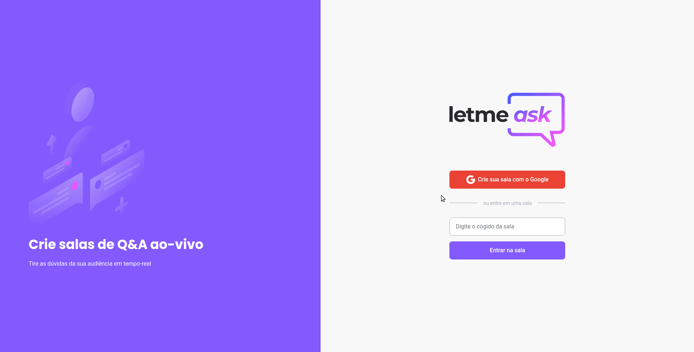
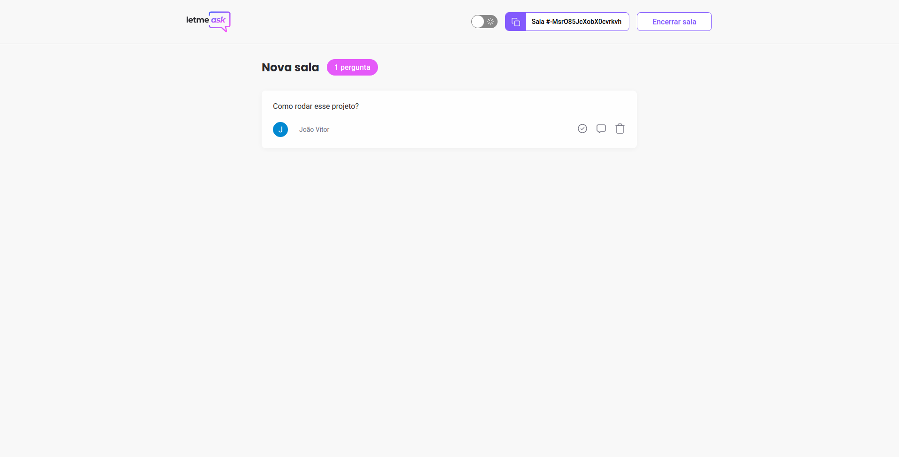

<h1 align="center">
  
</h1>

<p align="center">
  <a>
    
  </a>  
  <a>
    
  </a>
  <a>
    
  </a>
  <a href="https://lbesson.mit-license.org/"        target="_blank>
    
  </a>
      
</p>
<p align="center">

  <a target="_blank" href="https://reactjs.org/">
    
  </a>

  <a target="_blank" href="https://nextjs.org/">
      
  </a>
</p>

<h2 align="center"> 
 <strong>Letmeask</strong> | Complete 🚀 
</h2>

<p align="center">
 <a href="#-sobre-o-projeto">Sobre</a> •
 <a href="#-layout">Layout</a> • 
 <a href="#-como-executar-este-projeto">Como executar</a> • 
 <a href="#-tecnologias">Tecnologias</a> • 
 <a href="#funcionalidades-adicionais">Funcionalidades Adicionais</a> •
 <a href="#-autor">Autor</a> • 
 <a href="#-licença">Licença</a>
</p>

## 💻 Sobre o projeto

O **Letmeask** é uma aplicação para criadores de conteúdos poderem criar salas de Q&A com o seu público, de uma forma muito organizada e democrática.

##### Este é um projeto desenvolvido durante a **Next Level Week Together** oferecida pela [Rocketseat](https://rocketseat.com.br/), realizada nos dia 20 a 27 de Junho de 2021.

<br>

---
## 🎨 Layout
<br>

<a href="https://www.figma.com/file/w3QQ1TiOKAreSCHALyIr4Y/Letmeask-(Copy)?node-id=0%3A1">
  
</a>

**[Acessar Site](https://letmeask-9f3fe.web.app/)** Para testar

### **Web**

<p align="center">
  Um exemplo de execução    
  
</p>
 <br>
<p align="center">
  Página do Admin
  
</p>

---

## 🚀 Como executar este projeto 

### Pré-requisitos
Para executar esta aplicação, você deverá ter instalado em sua máquina as seguintes ferramentas:
* [Git](https://git-scm.com/)
* [Node.js](https://nodejs.org/en/)
* [NPM](https://www.npmjs.com/get-npm) ou [Yarn](https://yarnpkg.com/)

### 🎲 Rodando a aplicação web

Clone o projeto e acesse a pasta do mesmo:

```bash
$ git clone https://github.com/joaovitorJS/nlw-together-reactjs-letmeask.git
$ cd nlw-together-reactjs-letmeask
```

Para iniciá-lo, siga os passos abaixo:

```bash
## Passos com yarn
# Instale as dependências
$ yarn 

# Execute a aplicação em modo de desenvolvimento
$ yarn start

## Passos com npm
# Instale as dependências
$ npm install

# Execute a aplicação em modo de desenvolvimento
$ npm start

# O servidor web inciará na porta:3000 - 
# acesse http://localhost:3000 em seu navegador para ver a aplicação funcionando
```
Lembrando que será necessário criar uma conta no [Firebase](https://firebase.google.com/) e um projeto para disponibilizar um Realtime Database.

Modifique o arquivo [.env.example](.env.example) trocando o nome para `.env.example`.

---

## 🛠 Tecnologias

* **[TypeScript](https://www.typescriptlang.org/)**
* **[ReactJS](https://pt-br.reactjs.org/)**
* **[Firebase](https://firebase.google.com/)**
* **[Styled-Components](https://styled-components.com/)**
* **[React Router](https://reactrouter.com/docs/en/v6/getting-started/overview)**
* **[React Modal](https://github.com/reactjs/react-modal)**
* **[React-toastify](https://fkhadra.github.io/react-toastify/introduction)**


> Veja o arquivo  [package.json](https://github.com/joaovitorJS/nlw-05-podcastr/blob/master/package.json) para ver todas as dependências do projeto

---

<h2 id="funcionalidades-adicionais"> ⚙️ Funcionalidades Adicionais</h2>

* [X] Migrar os estilos do Sass para o Styled-Components
* [X] Dark Theme
* [X] Layout Responsivo
* [X] Modals de confirmação
* [X] Mensagens instantânea com React Toastify
---

## 🤔 Como contribuir para este projeto?

- Faça um **fork** do projeto;
- Crie uma nova branch com as suas alterações: `git checkout -b my-feature`, ou se preferir, `git branch my-feature && git git checkout my-feature`
- Salve as alterações e crie uma mensagem de commit contando o que você fez:`git commit -m "feature: My new feature"`
- Envie as suas alterações: `git push origin my-feature`

> Caso tenha alguma dúvida confira este [guia de como contribuir no GitHub](https://github.com/firstcontributions/first-contributions)

---
## 👨🏻‍💻 Autor
<br>
<p>
  
</p>

## **[João Vitor](https://github.com/joaovitorJS)**

#### Entre em contato

<br>

<p>
  <a href="https://www.instagram.com/jaovitooor/">
  
  </a>
  &nbsp;
  <a href="https://www.linkedin.com/in/jo%C3%A3o-vitor-oliveira-85a886174/" target="_blank">
  
  </a>
  &nbsp;
  <a href="mailto:rgm38342@comp.uems.br">
  
  </a>
</p>

---

## 📝 Licença

Esse projeto está sob a licença MIT. Veja o arquivo [LICENSE](LICENSE.md) para mais detalhes.